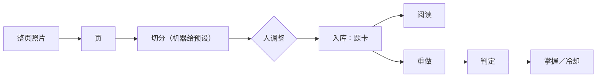

# 怎么用

这是一本**单用户**的错题本：把自己做错的题录进来、归因、打标，通过「纸上重做」与
「屏幕重做」两条通道反复重做，直到掌握。

:::note 录入只有一个入口
**往收件目录放一个文件，就是一次录入。** 电脑上的拖拽、手机上的上传、同步盘——都只是把文件
放进来的不同方式，之后走同一条管道：`页 → 切分 → 审核 → 入库`。
:::

## 三件事

| 你要做的 | 在哪 | 一句话 |
|---|---|---|
| **录入** | 首页或「细则」上的「上传整页照片」 | 整页照片进来 → 机器给出切分预设 → **你调整** → 入库 |
| **阅读** | 侧栏「科目 → 细则」里点某一道题 | 每题一页：题面、正解、你的原解与订正、掌握与重做历史 |
| **重做** | 侧栏「科目 → 今日重做」 | 敲一个答案 → 判定 → 进重做历史 → 推进掌握 |

## 左侧栏那棵索引怎么读

左侧栏就是索引本身，两级：**科目 →〔简报｜细则｜考点大纲｜今日重做〕**，最后还有**未归类**。

- **简报**：模型就这个科目近期状态写出的总结。它说的**每一个数字**都能在索引里找回；
  一条对不上就不会落盘——所以它可能是「过期」的，页面上会写清有几道新题没进去。
- **细则**：这个科目的全部错题，按**录入时间由新到老**。上面一排月卡按月索引；**最近那一个月**
  再按那一月里的周索引（点它只筛这一段，地址里带着筛选条件，可以刷新与分享）。
- **考点大纲**：这个科目下的**章 → 节 → 点**。
- **今日重做**：默认打印清单——未毕业、且已脱离冷却的错题。
- **未归类**：还没有科目的错题。**科目在录入时由你指定**（取值来自受控词表），
  没指定的不会被任何一科悄悄吸收。

## 两条界面纪律（不是 bug）

:::warning 答案只在阅读页出现
首页总览、细则、今日重做都**不印**正解与标准答案——那几个页面不是审核页。阅读页里默认也只给
**擦除手写后**的题面；要看原图必须由你显式打开，因为原图印着订正。
:::

:::info 切分不可用不是错误
机器没能切出块时，页**照建**、块列表是**空的**（`null`，而不是「这一页没有题」），
你可以直接在整页照片上自己画框。机器切分只是**预设**——切坏了，「重跑切分」是一个**破坏性**动作，
它会先把「将丢掉几处人工改动」报清、再问你一次。
:::

## 数据在哪

- 默认在**用户数据目录**：Windows `%APPDATA%\ai-note`、macOS `~/Library/Application Support/ai-note`、
  其它 `~/.local/share/ai-note`。仓库里的 `data/` 只是**测试语料**。
- **备份就是把那个目录复制走**；跑服务时可以用 `--data` 显式指到别处。
- 只有**模型调用**会离开本机，且限境内服务（DashScope、DeepSeek）。
- **录入一道题不会触发这个站点重新构建**：界面在运行时取数据，构建产物里没有任何一道题。
