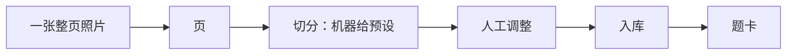

import UploadButton from '@site/src/components/UploadButton';

# 错题录入

<UploadButton from="intake" />

:::note 录入只有一个入口
**往收件目录放一个文件，就是一次录入。** 电脑上的拖拽、手机上的上传、同步盘——都只是把文件
放进来的不同方式，之后走同一条管道。
:::



## 管道上的四步

| 步骤 | 谁做 | 你会看到 |
|---|---|---|
| **收件** | 你放文件 | 收件目录里多一个文件（文件名是内容哈希，同一张照片放两次只有一个） |
| **建页** | 服务 | 一页一文件：整页照片 ＋ 它的块列表（`pages/<照片哈希前12位>.json`） |
| **切分** | 模型给**预设** | 一串候选块：位置、题号，以及每块里有没有红笔痕迹 |
| **入库** | 你点 | 只有「收」的块会拿到题卡 —— 骨架卡（题面转录、标准答案等都还空着，等审核填） |

## 工作台里你能做的

- **调整切分**：拖边界、把两块合并、把一块拆开。
- **新增一块**：机器切漏了一道题，直接在照片上画一个框——**默认「收」**。
- **删除一块**：画错的框可以删。已绑定题卡的块**永远不许删**（那张卡已经存在，
  要「不要它」请用「不收」）；删掉的块会留痕，**不会静默消失**。
- **改去留**：某一块不收，它不会入库，但块留在页上、理由也留着（可审计）。
- **改题号／题型**：题号连续性靠它；解答题不给作答框也靠它。
- **重跑切分**：这是一个**破坏性**动作——它会把这份块列表换回机器预设、丢掉人工改动。
  所以它先把「将丢掉几处」报清、再问你一次。
- **入库**：`created`／`reused`／`skipped`／`refused` 逐条显示，一条都不会被吞掉。

## 三条纪律（不是 bug）

:::warning 切分不可用不是错误
机器没能切出块时，页**照建**、块列表是**空的**（`null`，不是「这一页没有题」）。这时界面会直接
开放「新增一块」，你在照片上自己画即可。**机器切分只是预设**，不是唯一来源。
:::

:::info 科目在录入时由你指定
科目取自受控词表（语文、数学、外语、物理、化学、生物、政治、历史、地理）。**没指定就是「未归类」**
——它不会被任何一科悄悄吸收，侧栏里有专门一栏兜着它。科目取值不在词表里时会明确拒绝，并列出可选值。
:::

:::danger 答案只在阅读页出现
这一页与后续的审核都不会把答案印到清单上。入库建的是**骨架卡**，题面转录与标准答案等审核时再填。
:::

## 手机上传

手机与电脑在同一个局域网时，绑通配地址并把**手机真能打开的地址**显式给服务：

```bash
python3 -m server.app --host 0.0.0.0 --port 8765 --public-base http://192.168.1.50:8765
```

然后手机浏览器打开服务印出来的 `/upload`，拍照 → 上传。不传 `--public-base` 而绑 `0.0.0.0` 时，
启动日志与索引里都会警告「手机打不开这个地址」——**不会静默地给你一个打不开的链接**。
